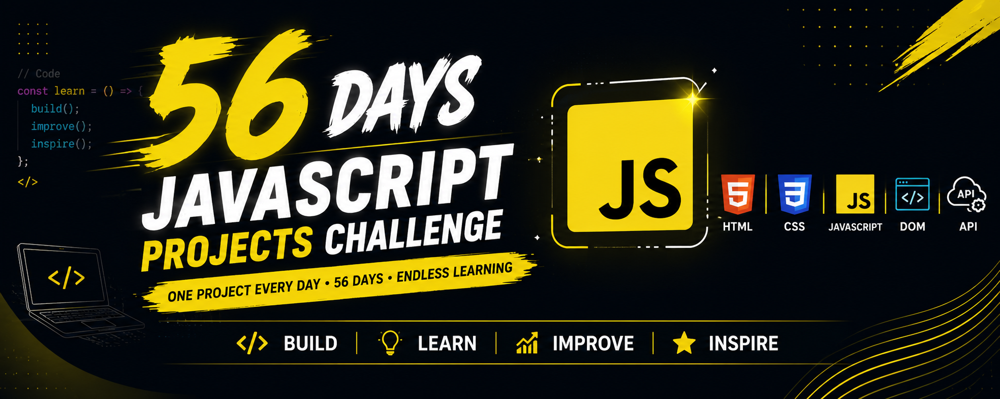

# 🚀 56 Days JavaScript Projects Challenge

<p align="center">
  
</p>

<p align="center">
  
  
  
  
</p>

---
# 👋 Welcome

Welcome to my **56 Days JavaScript Projects Challenge**!

This repository documents my journey of building **56 JavaScript projects in 56 consecutive days**.

The purpose of this challenge is to strengthen my JavaScript skills by building practical, real-world projects instead of only learning theory.

Every project is beginner-friendly, well-structured, and documented with explanations so that anyone can learn alongside me.

Whether you're a student, beginner, or developer, I hope this repository helps you improve your JavaScript skills through hands-on practice.

---
# 🎯 Challenge Goals

- 🚀 Build 56 JavaScript Projects
- 💡 Improve Problem Solving Skills
- 📚 Master Core JavaScript Concepts
- 🎨 Practice DOM Manipulation
- ⚡ Learn Browser APIs
- 🔥 Build Real-World Applications
- 📈 Stay Consistent Every Day
- 🤝 Help Beginners Learn Through Practical Projects

---
# 🛠 Technologies Used

- HTML5
- CSS3
- JavaScript (ES6+)
- DOM API
- Browser APIs
- Local Storage
- Fetch API
- JSON

---
# 📂 Repository Structure

```text
56-days-Challenge-of-the-Javascript-Project/

│── README.md
│── banner.png
│
├── Day-01-Calculator/
│   ├── README.md
│   ├── index.html
│   ├── style.css
│   ├── script.js
│   └── assets/
│
├── Day-02-Coming-Soon/
├── Day-03-Coming-Soon/
├── Day-04-Coming-Soon/
│
│   ...
│
└── Day-56-Final-Project/
```

---
# 📅 Challenge Progress

| Day | Project | Status |
|:---:|---------|:------:|
| ✅ Day 01 | [Calculator](./Day-01-Calculator) | Completed |
| ⏳ Day 02 | Coming Soon | In Progress |
| ⏳ Day 03 | Coming Soon | Pending |
| ⏳ Day 04 | Coming Soon | Pending |
| ⏳ Day 05 | Coming Soon | Pending |
| ... | ... | ... |
| ⏳ Day 56 | Final JavaScript Project | Pending |

---
# 📥 Download Individual Projects

GitHub doesn't currently provide an option to download a single folder directly.

To download an individual project:

### Step 1

Visit:

https://download-directory.github.io/

### Step 2

Copy the GitHub folder URL.

Example:

```text
https://github.com/Vijaykishore59/56-days-Challenge-of-the-Javascript-Project/tree/main/Day-01-Calculator
```

### Step 3

Paste the URL into the Download Directory website.

### Step 4

Click **Download**.

It will generate a ZIP file containing only that project.

---
# 🚀 Getting Started

Clone this repository:

```bash
git clone https://github.com/Vijaykishore59/56-days-Challenge-of-the-Javascript-Project.git
```

Navigate to any project folder.

Example:

```text
Day-01-Calculator
```

Open:

```text
index.html
```

in your browser.

---
# 📚 What You'll Learn

Throughout this challenge you'll practice:

- Variables
- Data Types
- Operators
- Functions
- Arrays
- Objects
- ES6 Features
- DOM Manipulation
- Event Handling
- Local Storage
- Fetch API
- JSON
- Responsive Web Design
- Real-World Project Development

---
# 🌟 Why This Repository?

- ✅ Beginner Friendly
- ✅ Clean Folder Structure
- ✅ Well Documented
- ✅ Simple and Readable Code
- ✅ Real-World Projects
- ✅ Daily Learning Journey
- ✅ Easy to Follow

---
# 🤝 Contributing

Contributions, suggestions, and improvements are always welcome.

If you'd like to contribute:

1. Fork this repository.
2. Create a new branch.
3. Commit your changes.
4. Submit a Pull Request.

---
# ⭐ Support

If this repository helps you learn something new, please consider giving it a **⭐ Star**.

Your support motivates me to continue building high-quality projects and sharing them with the developer community.

---
# 👨‍💻 About Me

Hi, I'm **Vijay Kishore**.

I'm a Computer Science graduate passionate about:

- Software Development
- JavaScript
- React
- Python
- Full Stack Development
- Problem Solving

This repository documents my journey of becoming a better developer by building projects consistently every day.

---
# 📬 Connect With Me

### GitHub

https://github.com/Vijaykishore59

### LinkedIn

https://www.linkedin.com/in/vijaykishoresunkara/

---
# 📈 Challenge Progress

```text
█□□□□□□□□□□□□□□□□□□□□□□□□□□□□□□□□□□□□□□□□□□□□□□

Day 01 / 56 Completed
```

---

# 💙 Let's Build Together

> **"Consistency beats perfection. One project every day is one step closer to mastery."**

Thank you for visiting this repository.

If you're learning JavaScript, feel free to explore the projects, learn from the code, and build them yourself.

**Happy Coding! 🚀**
